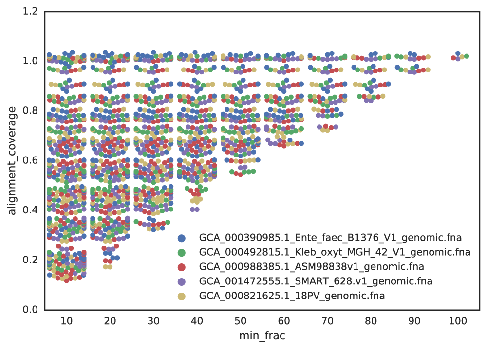
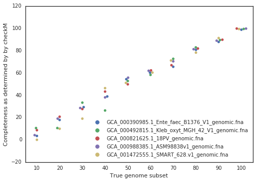

Choosing parameters
===================

The values used during de-replication and genome comparison are critical to understanding what the program is actually doing to your genome set.

There are two critical high-level decisions you must make before running dRep to de-replicate a genome set:

**1. How similar do genomes need to be for them to be considered the “same”?**

**2. What is the minimum genome completeness allowed in analysis?**

.. seealso::
  :doc:`module_descriptions`
    For more general descriptions of routine parameters

What defines genomes as being "same"?
-------------------------------------

There is no standard definition of the average nucleotide identity (ANI) shared between two genomes that are the "same". This is a decision that the user must make on their own, depending on their own specific application. The ANI is determined by the **secondary clustering algorithm**, the **minimum secondary ANI** is the minimum ANI between genomes to be considered the "same", and the **minimum aligned fraction** is the minimum amount of genome overlap to believe the reported ANI value.

.. tip::
  For help choosing this threshold, see the blog post: `Are these microbes the “same”?  <https://www.microbe.net/2017/02/15/are-these-microbes-the-same/>`_.

Secondary clustering algorithm
++++++++++++++++++++++++++++++

The **secondary clustering algorithm** is the program that will calculate the accurate Average Nucleotide Identity (ANI) between genomes. The current options supported by dRep are ANIm (`Richter 2009 <https://www.ncbi.nlm.nih.gov/pubmed/19855009>`_) and gANI (`Varghese 2015 <https://www.ncbi.nlm.nih.gov/pmc/articles/PMC4538840/>`_).

* **ANIm** aligns whole genome fragments and calculates the nucleotide identity of aligned regions
* **gANI** aligns ORFs called by prodigal and calculates the nucleotide identity of aligned ORFs

Neither of these algorithms are perfect, especially in repeat-prone genomes. Regions of the genome which are not homologous can align to each other and artificially decrease ANI. In fact, when a genome is compared to itself, ANIm often reports values <100% for this reason. gANI is better about this, but seems to be more sensitive to genome subsetting.

* **ANImf** is very similar to ANIm, but filters the alignment before calculating ANI. This takes slighty more time, but is much more accurate with repeat regions

Minimum secondary ANI
+++++++++++++++++++++

The **minimum secondary ANI** is the minimum ANI between genomes for them to be considered the "same". For context, genomes of the same species typically have >=96.5% gANI (`Varghese 2015 <https://www.ncbi.nlm.nih.gov/pmc/articles/PMC4538840/>`_).

The default value in dRep is 99%. Preliminary testing suggests that with gANI taking this up to 99.9% is probably safe, but higher than that is beyond the limit of detection. For ANIm you really can't go above 99%, as a comparison of a genome to itself can sometimes get that low. gANI is more thrown by genome incompleteness; ANIm is more thrown by repeat-regions.

.. note::

  Keep in mind that in all cases you are collapsing closely related, but probably not identical, strains / genomes. This is simply the nature of the beast. If desired, you can compare the strains by mapping the original reads back to the de-replicated genome to visualize the strain cloud (`Bendall 2016 <http://www.nature.com/ismej/journal/v10/n7/full/ismej2015241a.html>`_, `blog post <http://merenlab.org/2015/07/20/analyzing-variability/>`_), or by comparing genomes within a secondary cluster using other methods (like `Mauve <http://darlinglab.org/mauve/mauve.html>`_)

Minimum aligned fraction
++++++++++++++++++++++++

The **minimum aligned fraction** is the minimum amount that genomes must overlap to make the reported ANI value "count". This value is reported as part of the ANIm/gANI algorithms.

Imagine a scenario where two genomes of a separate phyla share a single identical transposon. When the ANIm/gANI algorithm is run, the transposon is probably the only part of the genomes that aligns, and the alignment will have 100% ANI. This will result in a reported ANI of 100%, and reported **aligned fraction** of ~0.1%. The **minimum aligned fraction** is to handle the above scenario- anything with less than the minimum aligned fraction of genome alignment will have the ANI changed to 0. Default value is 10%.

.. note::

  It has been suggested that a minimum aligned fraction of 60% should be applied to species-level taxonomic definitions (`Varghese 2015 <https://www.ncbi.nlm.nih.gov/pmc/articles/PMC4538840/>`_). However, this is probably too stringent when incomplete genomes are being used (as is the case with genome de-replication)

What is the minimum genome completeness allowed in analysis?
------------------------------------------------------------

This decision is much more complicated than the previous. Essentially, there exists a trade-off between computational efficiency and the minimum genome completeness.

  **Figure A**: Five genomes are subset to fractions ranging from 10% - 100%, and fractions from the same genome are compared. The x-axis is the minimum genome completeness allowed. The looser this value is, the wider the range of aligned fractions.

As shown in the above Figure A, the lower the limit of genome completeness, the lower possible aligned fraction of two genomes. This makes sense- if you randomly take 20% of a genome, and than do the same thing again, when you compare these two random 20% subsets you would not expect very much of them to align. This "aligned fraction" really becomes a problem when you consider it's effect on Mash:

.. figure:: images/subsettingv0.png
  :width: 400px
  :align: center

  **Figure B**: An identical *E. coli* genome is subset to fractions ranging from 10% - 100% and fractions are compared. When lower amounts of the genome align (due to incompleteness), Mash ANI is severely impacted

As shown in the above Figure B, the lower the aligned fraction, the lower the reported Mash ANI **for identical genomes**.

Remember- genomes are first divided into primary clusters using Mash, and then each primary cluster is divided into secondary clusters of the "same" genomes. Therefore, genomes which fit the definition of “same” **must** end up in the same primary cluster, or the program will never realize they're the same. As more incomplete genomes have lower Mash values (even if the genomes are truly identical; see **Figure B**), the more incomplete of genomes you allow into your genome list, the more you must decrease the **primary cluster threshold**.

.. note::

  Having a lower **primary cluster threshold** which will result in larger primary clusters, which will result in more required secondary comparisons. This will result in a longer run-time.

Still with me?

For example, say I set the minimum genome completeness to 50%. If I take an *E. coli* genome, subset it 50% 2 times, and compare those 2 subset genomes together, Mash will report an ANI of 96%. Therefore, the primary cluster threshold must be at least 96%, otherwise the two genomes could end up in different primary clusters, and thus would never have have the secondary algorithm run between them, and thus would not be de-replicated.

You don't want to set the primary cluster threshold super low, however, as this would result in more genomes being included in each primary cluster, and thus more secondary comparisons (which are slow), and thus a higher run-time.

Putting this altogether gives us a figure with the lowest reported ANI of identical genomes being subset to different fractions. This figure only takes into account 5 different genomes, but gives a rough idea of the limits.

.. figure:: images/minANI.png
  :width: 400px
  :align: center

A final piece to consider is that when running dRep for real, the user doesn't actually know how incomplete their genomes are. They have to rely on metrics like single copy gene inventories to tell them. This is the reason phage and plasmids are not currently supported by dRep- there is no way of knowing how complete they are, and thus no way of filtering out the bins that are too incomplete. In general though, checkM is pretty good at accessing genome completeness:

.. note::

  Some general guidelines for picking genome completeness thresholds:

  * Going below 50% completeness is not recommended. The resulting genomes will be very crappy anyways, and even the secondary algorithms break-down at this point.
  * Lowering the secondary ANI should result in a consummate lowering in MASH ANI. This is because you want Mash to group non-similar *and* incomplete genomes.
  * To make sure clusters are not being split unnecessarily, you can run the warnings at the end. See :doc:`module_descriptions` for info

The Rest
--------

The most important and confusing parameters are described above. For information on the other parameters, see :doc:`module_descriptions`
