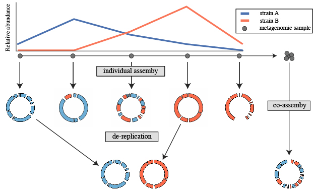
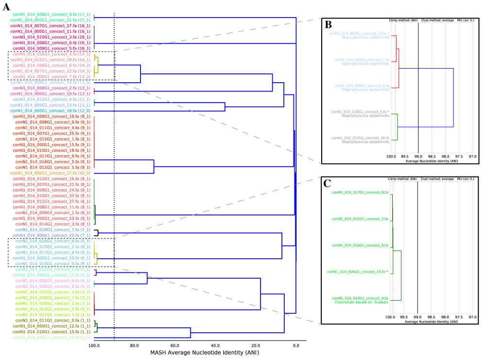

Overview
========

dRep is a python program which performs rapid pair-wise comparison of genome sets. One of it's major purposes is for genome de-replication, but it can do a lot more.

The publication is available at ISME_ and an open-source pre-print is available on bioRxiv_.

Source code is `available on GitHub
<https://github.com/MrOlm/drep>`_.

Genome de-replication
---------------------

De-replication is the process of identifying sets of genomes that are the "same" in a list of genomes, and removing all but the "best" genome from each redundant set. How similar genomes need to be to be considered "same", how to determine which genome is "best", and other important decisions are discussed in :doc:`choosing_parameters`

A common use for genome de-replication is the case of individual assembly of metagenomic data. If metagenomic samples are collected in a series, a common way to assemble the short reads is with a "co-assembly". That is, combining the reads from all samples and assembling them together. The problem with this is assembling similar strains together can severely fragment assemblies, precluding recovery of a good genome bin. An alternative option is to assemble each sample separately, and then "de-replicate" the bins from each assembly to make a final genome set.

The steps to this process are:

* Assemble each sample separately using your favorite assembler. You can also perform a co-assembly to catch low-abundance microbes
* Bin each assembly (and co-assembly) separately using your favorite binner
* Pull the bins from all assemblies together and run dRep on them
* Perform downstream analysis on the de-replicated genome list

Genome comparison
-----------------

Genome comparison is simply comparing a list of genomes in a pair-wise manner. This allows identification of groups of organisms that share similar DNA content in terms of Average Nucleotide Identity (ANI).

dRep performs this in two steps- first with a rapid primary algorithm (Mash), and second with a more sensitive algorithm (gANI). We can't just use Mash because, while incredibly fast, it is not robust to genome incompletenss (see :doc:`choosing_parameters`) and only provides an "estimate" of ANI. gANI is robust to genome incompleteness and is more accurate, but too slow to perform pair-wise comparisons of longer genome lists.

dRep first compares all genomes using Mash, and then only runs the secondary algorithm (gANI or ANIm) on sets of genomes that have at least 90% Mash ANI. This results it a great decrease in the number of (slow) secondary comparisons that need to be run while maintaining the sensitivity of gANI.

.. See the `publication <https://www.youtube.com/watch?v=dQw4w9WgXcQ>`_ for details

.. _bioRxiv: https://doi.org/10.1101/108142
.. _ISME: http://www.nature.com/ismej/journal/vaop/ncurrent/full/ismej2017126a.html
