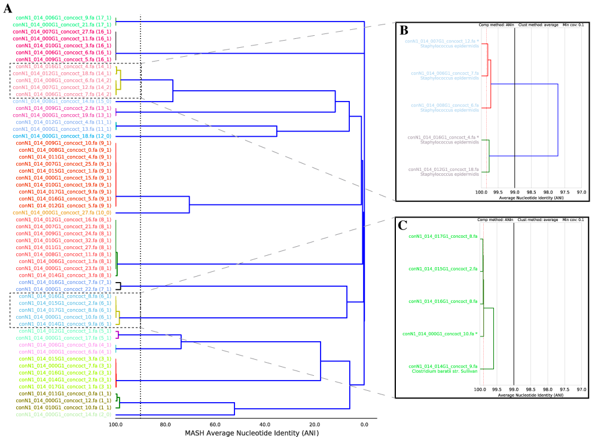
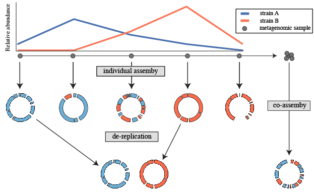

Overview
========

dRep is a python program which performs rapid pair-wise comparison of genome sets. One of it's major purposes is for genome de-replication, but it can do a lot more.

The publication is available at ISME_ and an open-source pre-print is available on bioRxiv_.

Source code is `available on GitHub
<https://github.com/MrOlm/drep>`_.

Genome comparison
-----------------

dRep can rapidly and accurately compare a list of genomes in a pair-wise manner. This allows identification of groups of organisms that share similar DNA content in terms of Average Nucleotide Identity (ANI).

dRep performs this in two steps. **Primary clustering** groups genomes that could plausibly be the same organism, using a permissive threshold and single-linkage (connected components). **Secondary clustering** then runs within each of those groups, using average-linkage hierarchical clustering to decide which genomes actually are the same.

Both steps matter. Primary clustering is deliberately inclusive, and it partitions the genomes so that the more expensive secondary clustering only ever has to consider a small group at a time. Secondary clustering uses average linkage, which is what stops a chain of similar-but-distinct strains from collapsing distinct species into one cluster.

As of v4 both steps default to `skani <https://github.com/bluenote-1577/skani>`_. Primary clustering runs it in ``--sparse`` mode, which only emits pairs above a screening threshold, so dRep never builds or stores the full N x N comparison table. Because secondary clustering only compares genomes *within* a primary cluster, those pairs are a subset of what the primary pass already computed, so it reuses them rather than running the comparisons a second time.

Older versions used Mash for primary clustering and an alignment-based algorithm (ANIm) for secondary. That path is still available (``--primary_algorithm MASH``, ``--S_algorithm ANImf``), but it computes all N x N Mash comparisons up front, which is slower and uses far more memory on large genome sets.

.. See the `publication <https://www.youtube.com/watch?v=dQw4w9WgXcQ>`_ for details

.. _bioRxiv: https://doi.org/10.1101/108142
.. _ISME: http://www.nature.com/ismej/journal/vaop/ncurrent/full/ismej2017126a.html

Genome de-replication
---------------------

De-replication is the process of identifying sets of genomes that are the "same" in a list of genomes, and removing all but the "best" genome from each redundant set. How similar genomes need to be to be considered "same", how to determine which genome is "best", and other important decisions are discussed in :doc:`choosing_parameters`

A common use for genome de-replication is the case of individual assembly of metagenomic data. If metagenomic samples are collected in a series, a common way to assemble the short reads is with a "co-assembly". That is, combining the reads from all samples and assembling them together. The problem with this is assembling similar strains together can severely fragment assemblies, precluding recovery of a good genome bin. An alternative option is to assemble each sample separately, and then "de-replicate" the bins from each assembly to make a final genome set.

The steps to this process are:

* Assemble each sample separately using your favorite assembler. You can also perform a co-assembly to catch low-abundance microbes
* Bin each assembly (and co-assembly) separately using your favorite binner
* Pull the bins from all assemblies together and run dRep on them
* Perform downstream analysis on the de-replicated genome list

.. note::

  See the publication `To Dereplicate or Not To Dereplicate? <https://msphere.asm.org/content/5/3/e00971-19>`_ for an outside perspective on the pro's and con's of dereplication

A dRep based metagenomic workflow
----------------------------------

One method of genome-resolved metagenomic analysis that I am fond of involves the following steps:

1) Assemble and bin all metagenomic samples to generate a large database of metagenome-assembled genomes (MAGs)

2) Dereplicate all of these genomes into a set of species-level representative genomes (SRGs). This is done with dRep using a 95% ANI threshold.

3) Create a mapping database from all SRGs, and map all metagenomes to this database. Each sample will now be represented by a `.bam` file mapped against the same database.

4) Profile all .bam files using `inStrain <https://github.com/MrOlm/instrain>`_. This provides a huge number of metrics about the species-level composition of each metagenomes.

5) Preform strain-level comparisons between metagenomes using `inStrain <https://github.com/MrOlm/instrain>`_

Some example publications in which this workflow is used are `here <https://doi.org/10.1101/2020.01.22.915579>`_ and `there <https://advances.sciencemag.org/content/5/12/eaax5727>`_.

